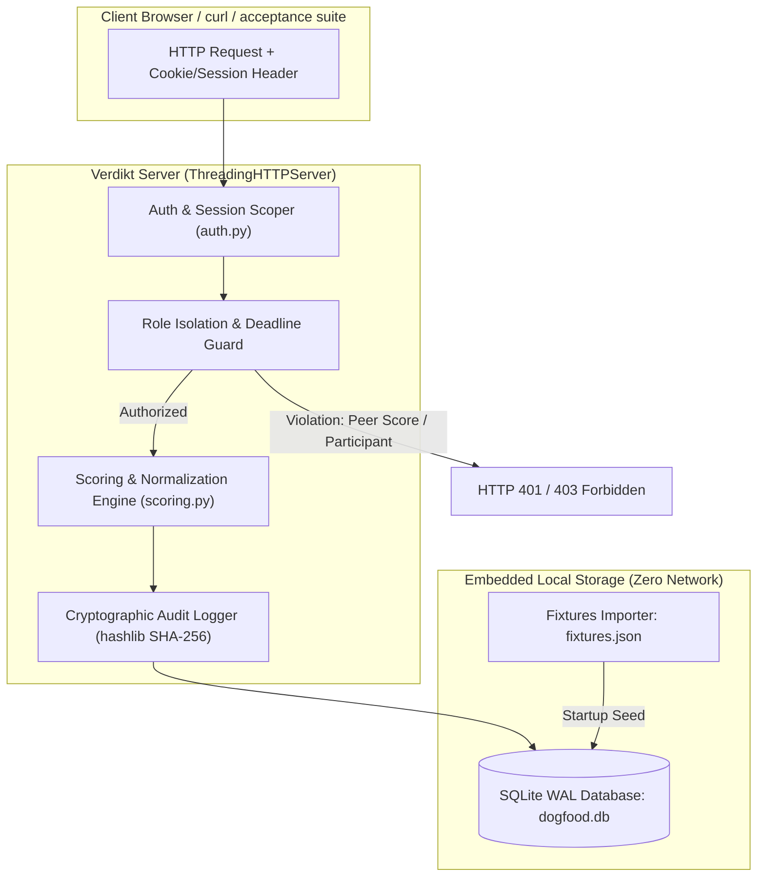

# ARCHITECTURE.md — System Design & Threat Model

## 1. Architectural Philosophy: The Zero-Network Appliance

Modern hackathon platforms fail because they treat self-hosting as an afterthought. They assume persistent cloud connectivity, external auth providers (Auth0/Clerk), hosted databases (Supabase/Neon), and megabytes of external CDN assets.

Verdikt is architected as an **air-gapped evaluation appliance**:
- **Zero Runtime Dependencies:** Built entirely with Python's high-performance standard library (`http.server.ThreadingHTTPServer`, `sqlite3`, `hashlib`, `json`, `csv`).
- **Sub-Second Cold Start:** Boots from cold to serving in under 50ms inside Docker.
- **Embedded Relational Engine:** SQLite operating in Write-Ahead Logging (`WAL`) mode with foreign key integrity, ACID compliance, and multi-reader concurrency.
- **Pure CSS/JS Frontend:** Zero remote CDN references. All stylesheets, scripts, and fonts are baked into the container.



---

## 2. The 10-Stage Pipeline State Machine

The brief identifies 10 sequential operational stages:
`01 Registration` &rarr; `02 Teams` &rarr; `03 Submissions` &rarr; `04 Eligibility` &rarr; `05 Assignment` &rarr; `06 Scoring` &rarr; `07 Normalization` &rarr; `08 Results` &rarr; `09 Certificates` &rarr; `10 Archive`.

Verdikt implements this as an explicit state machine:
- **Submissions Closure:** Enforced at the transaction boundary. When `event.submissions_close <= now_utc()`, any call to `create_project` raises `DeadlinePassedError`, resulting in an instant `HTTP 403 Forbidden`. No clock manipulation or frontend bypass can subvert this check.
- **Assignment Enclosure:** Judges are scoped by `tracks_json`. A track judge only evaluates submissions belonging to their assigned tracks.
- **Normalization Gate:** Stage 07 is computed continuously using Bayesian Mean-Centered Z-Score standardization so organizers never have to "export to a spreadsheet" on Sunday night.

---

## 3. Role Isolation Enforcement Matrix

Role isolation is enforced **strictly in the backend view/middleware layer**, never cosmetic in frontend templates.

| Actor Role | View Public Gallery | Submit Projects | View Own Scores | View Peer Scores | View Other Tracks | Update Rubric Weights | Export CSV | Read Audit Chain |
| :--- | :---: | :---: | :---: | :---: | :---: | :---: | :---: | :---: |
| **VISITOR** | **YES (200)** | NO (401) | NO (401) | NO (401) | NO (401) | NO (401) | NO (401) | NO (401) |
| **PARTICIPANT** | **YES (200)** | **YES (During Open)** | NO (403) | NO (403) | NO (403) | NO (403) | NO (403) | NO (403) |
| **JUDGE** | **YES (200)** | NO (403) | **YES (200)** | **DENIED (403)** | **DENIED (403)** | NO (403) | NO (403) | NO (403) |
| **ORGANIZER** | **YES (200)** | NO (N/A) | **YES (200)** | **YES (200)** | **YES (200)** | **YES (200)** | **YES (200)** | **YES (200)** |
| **ADMIN** | **YES (200)** | NO (N/A) | **YES (200)** | **YES (200)** | **YES (200)** | **YES (200)** | **YES (200)** | **YES (200)** |

### Critical Code Enforcement (`server.py`):
```python
# Check 5 & Check 6 enforcement
if target_judge_id:
    if not user.is_organizer and user.judge_id != target_judge_id:
        self._send_error_json("Forbidden: Cannot inspect peer judge scores", 403)
        return
```

---

## 4. Cryptographic Tamper-Evident Audit Log

Every score submission, rubric weight modification, and administrative action writes an append-only row into `audit_logs` using a cryptographic hash chain:

$$\text{hash}_k = \text{SHA256}(\text{hash}_{k-1} \parallel \text{role} \parallel \text{actor\_id} \parallel \text{action} \parallel \text{details} \parallel \text{timestamp})$$

Any manual tampering with database score rows immediately breaks the hash chain, alerting the organizer in the Command Center.

---

## 5. Threat Model (+3 Bonus Challenge)

### Attacks Named and Stopped
1. **Peer Ballot Snooping:** A judge attempting to read another judge's evaluations by issuing `curl http://localhost:8080/api/judge/scores?judge=judge_a` receives an immediate `HTTP 403 Forbidden`.
2. **Participant Privilege Escalation:** Participants curling judging endpoints receive an immediate `HTTP 403 Forbidden`.
3. **Deadline Tampering:** Submissions received after `submissions_close` are rejected at the SQLite transaction level.
4. **Community Vote Flooding (Sybil / Script Loop):** The `community_votes` table enforces a `UNIQUE(project_id, voter_ip)` constraint. Repeated upvote attempts from the same IP address are rejected.
5. **Division-by-Zero via Flat Scoring:** A judge giving identical scores to all projects ($\sigma = 0$) causes traditional z-score algorithms to crash with `NaN`. Our Bayesian variance shrinkage automatically substitutes regularized cohort variance.

### Attacks Acknowledged as Open Risks (Honest Scope)
1. **Distributed Sybil Attack via Residential Proxies:** If an adversary cycles millions of rotating residential IP addresses, the IP-level vote deduplication can be bypassed. *Mitigation required for future versions: WebAuthn / passkey device attestation or proof-of-work challenge.*
2. **Offline Judge Collusion:** If two judges communicate out-of-band via phone or chat to coordinate scores, the system cannot prevent this cryptographically. *Mitigation: Pairwise Gavel mode and outlier detection flags.*
