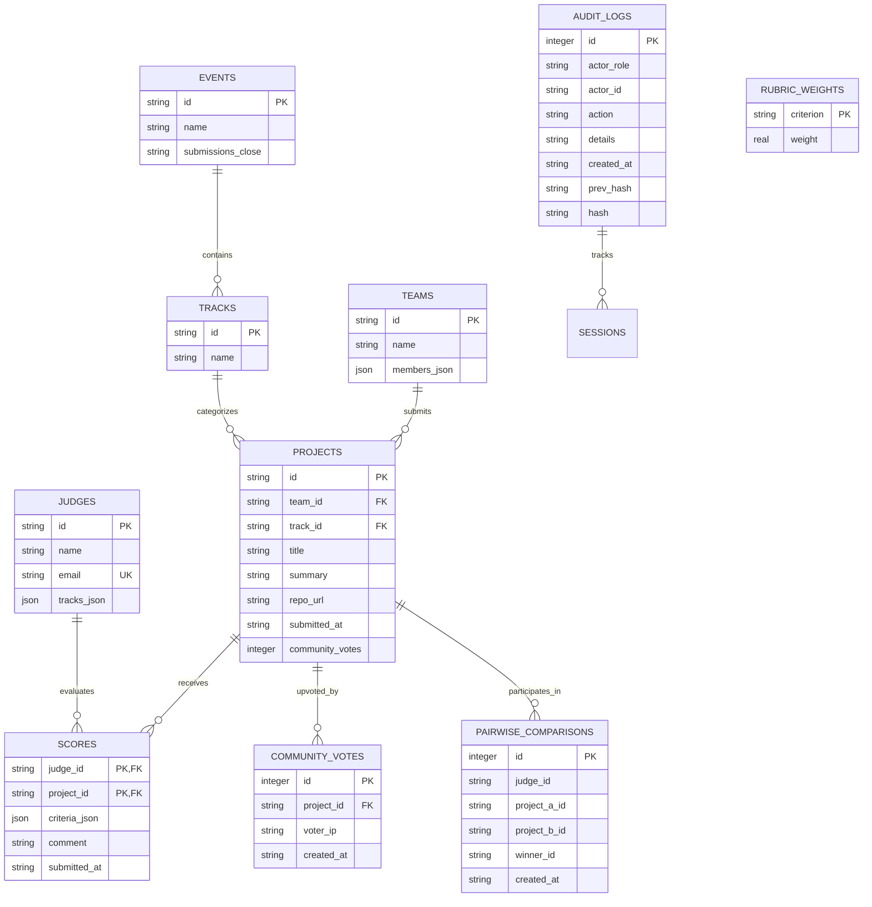

# DATA-MODEL.md — Schema Specification & Data Mobility

## 1. Relational Entity-Relationship Diagram

---

## 2. Table Specifications & Constraints

### `events`
* `id` (TEXT, PK): Unique event identifier (`evt_01`).
* `name` (TEXT): Display name (`Sample Hack 2026`).
* `submissions_close` (TEXT, ISO 8601): Strict UTC timestamp. Checked before any project insertion.

### `tracks`
* `id` (TEXT, PK): Track identifier (`trk_01` to `trk_08`).
* `name` (TEXT): Track title (e.g. `Developer tools`, `Security`).

### `judges`
* `id` (TEXT, PK): Judge identifier (`jdg_01` to `jdg_30`).
* `name` (TEXT): Judge's full name.
* `email` (TEXT, UNIQUE): Registered contact.
* `tracks_json` (TEXT): Array of track IDs the judge is assigned to evaluate.

### `projects`
* `id` (TEXT, PK): Unique project identifier (`prj_01` to `prj_41`).
* `team_id` (TEXT, FK): References `teams(id)`.
* `track_id` (TEXT, FK): References `tracks(id)`.
* `title` (TEXT): Project title.
* `summary` (TEXT): Short one-line elevator pitch.
* `repo_url` (TEXT): Public source repository.
* `submitted_at` (TEXT, ISO 8601): Timestamp of submission.
* `community_votes` (INTEGER): Cached upvote count.

### `scores`
* Composite Primary Key: `(judge_id, project_id)`. Prevents duplicate ballots while enabling idempotent updates.
* `criteria_json` (TEXT): JSON map of criteria to scores (e.g. `{"functionality": 4, "quality": 3, "innovation": 5}`).
* `comment` (TEXT): Written qualitative feedback from the judge.

### `comments`
* `id` (INTEGER, PK AUTOINCREMENT): Unique comment identifier.
* `project_id` (TEXT, FK): References `projects(id)`.
* `author_name` (TEXT): Display name of commenter.
* `author_role` (TEXT): Role classification (`visitor`, `participant`, `judge`, `organizer`).
* `content` (TEXT): Feedback text.
* `created_at` (TEXT, ISO 8601): Timestamp.

### `team_invites`
* `code` (TEXT, PK): 8-character cryptographic token.
* `team_id` (TEXT): Identifier of team.
* `team_name` (TEXT): Human-readable team name.
* `created_by` (TEXT): User ID of creator.
* `created_at` (TEXT, ISO 8601): Timestamp.

### `judge_assignments`
* `id` (INTEGER, PK AUTOINCREMENT)
* `judge_id` (TEXT, FK): References `judges(id)`.
* `project_id` (TEXT, FK): References `projects(id)`.
* `assigned_at` (TEXT, ISO 8601)
* Unique Constraint: `UNIQUE(judge_id, project_id)`.

### `quadratic_votes`
* `id` (INTEGER, PK AUTOINCREMENT)
* `voter_id` (TEXT): Voter identifier or IP token.
* `project_id` (TEXT, FK): References `projects(id)`.
* `credits_spent` (INTEGER): Credits expended (1, 4, 9, 16, or 25).
* `vote_weight` (REAL): Calculated influence ($\sqrt{\text{credits}}$).
* Unique Constraint: `UNIQUE(voter_id, project_id)`. Max 100 total credits per voter.

### `webhooks`
* `id` (INTEGER, PK AUTOINCREMENT)
* `url` (TEXT): Webhook destination HTTP endpoint.
* `event_types` (TEXT): Comma-separated events (e.g. `project.submitted,score.recorded`).
* `secret` (TEXT): HMAC secret token.
* `is_active` (INTEGER): Toggle flag.

### `verifiable_records`
* `id` (TEXT, PK): Unique record certificate ID (`cert_jdg_...`).
* `record_type` (TEXT): Participation classification.
* `subject_id` (TEXT): Recipient identifier.
* `subject_name` (TEXT): Recipient name.
* `details_json` (TEXT): Serialized payload metadata.
* `issued_at` (TEXT, ISO 8601): Timestamp.
* `signature_hash` (TEXT): Cryptographic SHA-256 tamper-evident digest.

### `community_votes`
* Unique Constraint: `UNIQUE(project_id, voter_ip)`. Prevents ballot stuffing and script loops.

---

## 3. Handling Edge Cases in `fixtures.json`

The fixture dataset includes deliberate operational edge cases designed to test platform resilience:

1. **Unbalanced Review Counts:** Some projects have 5 reviews, others have 2 reviews, and some have 0.
   * *Mitigation:* The scoring engine weights projects by average standardized scores rather than raw sums, preventing projects with more reviews from dominating based solely on volume.
2. **Zero-Variance Judge (`jdg_07`):** Judge 07 scored every single project `4.0` ($\sigma = 0$).
   * *Mitigation:* Standard z-score calculations divide by $\sigma$, yielding a division-by-zero (`NaN`). Our Bayesian variance shrinkage automatically incorporates cohort standard deviation, ensuring $\hat{\sigma} > 0$.
3. **Sparse Single-Review Judges (`jdg_01`, `jdg_23`):** Judges who only reviewed a single project before abandoning their batch.
   * *Mitigation:* Bayesian shrinkage regularizes sample mean and variance towards the global prior, preventing extreme z-score distortions.

---

## 4. Import & Export Mobility

A platform that cannot be exported is an operational trap. Verdikt guarantees 100% two-way data mobility:

### Exporting Data
* **Streaming CSV (`GET /api/export.csv`):** Produces a standardized CSV file with columns:
  `Rank, Delta_Rank, Project_ID, Title, Track, Team, Raw_Score, Normalized_Score, Reviews_Count, Community_Votes, Repo_URL`
* **JSON Dumps (`GET /api/projects`):** Returns complete, uncompressed JSON payloads matching the format of `fixtures.json`.

### Importing Data
* **Fixture Seeder (`src/seed.py`):** Automatically ingests `fixtures.json` on initial boot using transactional `INSERT OR REPLACE` statements. It can be rerun at any time without data corruption.
